# NeuralPDESpeedrun.py

A speedrun for **data-free** PDE solving. Each track is one PDE problem: solve it as fast as possible on one
H100, from the governing equations alone, to a fixed accuracy against a closed-form or high-resolution
reference.

**Goals.** The classical solvers here are reference points, not opponents to beat on every track. We want to
(1) improve hybrid neural methods, measured honestly on wall-clock time-to-accuracy, and (2) find problems
where hybrid neural methods give outsized leverage, i.e. where classical methods are slow. New tracks that
expose such regimes are as valuable as new records. We do not expect one method to win every track; each
submission competes per track.

## Quickstart

```bash
uv sync
uv run python -m speedrun.run --track 0D_VanDerPol                       # time + score a track's baseline
uv run python -m speedrun.run_submission --submission submission_PR0001 --gpus 0,1,2,3 \
    --name "PirateNet + SOAP" --kind neural --pr 1                  # one submission on all its tracks
uv run python -m speedrun.records --track all                       # leaderboards, plots, READMEs
```

The environment targets H100 GPUs (NVIDIA driver ≥ 580): `uv sync` installs Python 3.13 and torch 2.15 built for CUDA 13.2;
submissions that use JAX add it with its CUDA 13 wheels (`jax[cuda13]`).

Reference solutions are not in git. They are assets of the GitHub release
[`refs-v1`](https://github.com/vpuri3/NeuralPDESpeedrun.py/releases/tag/refs-v1), downloaded into
`tracks/<track>/reference/ref.npz` the first time a track is scored and checked against the sha256 in its
`meta.json`. `uv run python -m speedrun.make_reference --track <track|all> --device cuda` rebuilds them (and
the figures) from scratch; it downloads the published benchmark data (~300 MB, cached in
`~/.cache/neuralpdespeedrun`). `run_submission` runs one job per GPU at a time, writes each track's
`result.json`, and with `--name` adds the results to the records and regenerates the plots and tables. Tracks
are named by their id (`1D_Burgers`, case-insensitive) or, when unique, by the problem name (`Burgers`).

## Scoring

Score = wall-clock time of `solve` + `query`, provided the output meets the track's
accuracy bar against the reference. All fields and evaluation points are flattened into one vector u
(`(n_fields, ...)` → `(n_fields · N,)`), and both errors are relative to the reference vector:

- **RelL2** `‖u − u_ref‖₂ / ‖u_ref‖₂ ≤ 0.5%`
- **RelL∞** `max |u − u_ref| / max |u_ref| ≤ 1%`

The bar is the same on every track; a track may exclude a wall margin from RelL∞. Pressure is never scored. Each track has a
wall-clock budget for the solve (`problem.budget_s`, 1000 s unless the track says otherwise), enforced by the
harness: once it is used up, the harness interrupts `solve` and scores what `query` returns for the last
checkpointed state.

## Rules

1. **Data-free.** Use only what `Problem` provides. No reference or solver outputs, precomputed solutions,
   downloaded data, or pretraining of any kind. A closed form used to manufacture forcing is off limits.
2. **Anything else goes.** Any model, ansatz, loss, optimizer, discretization, precision, or mix of neural and
   classical parts. PyTorch, JAX, and Julia are all fine (the entry point is Python; `Problem` callables accept
   torch or JAX arrays), and so are hand-written GPU kernels (Triton, CUDA, ...).
3. **No oracle.** The method decides when to stop (return from `solve`), within the budget; it is scored once,
   on what it returns or last checkpointed. The reference is loaded only after the clock stops.
4. **Timing.** `setup` is untimed and may build and compile, but not train on the problem or compute any part
   of its solution. `solve` and `query` are each timed, with the device (torch and JAX) synchronized before the
   clock stops; `query` must finish in ≤ 5 s. The harness, not the submission, keeps the clock and the budget.
5. **One run, seed 0, on the GPU.** The harness reruns the submission once (untimed, with a 10 s budget) to see
   where it computes: torch ops are counted by device, JAX by the device of its arrays. Other work (Julia,
   custom kernels) is checked by the maintainers.
6. **Official times** are maintainer re-timings on one H100 80GB. Record #0 on each track is an honest but
   deliberately unoptimized classical baseline; it is kept in `records.json` but, for now, left out of the
   plots and record tables (`SHOW_CLASSICAL` in `speedrun/records.py`).

## Submission API

Per track, `tracks/<track>/submissions/submission_PR<NNNN>/solve.py` defines up to three functions:

| function | timed | required | role |
|---|---|---|---|
| `setup(problem) -> state` | no | no | build, allocate, compile; no training, no part of the solution |
| `solve(problem, state, checkpoint) -> state` | yes | yes | train / iterate for as long as you like; `checkpoint(state)` often |
| `query(problem, state) -> array` | yes, ≤ 5 s | unless `solve` returns the output | evaluate the solution at the output points |

```python
def setup(problem):
    return MySolver(problem).compile()               # untimed

def solve(problem, solver, checkpoint):
    while True:                                      # open-ended: the harness enforces the budget
        solver.train(iterations=50)
        checkpoint(solver.snapshot())                # what query() gets if the budget runs out now
        if solver.converged():
            return solver.snapshot()                 # or stop early yourself

def query(problem, state):
    return state.predict(problem.axes)               # torch / JAX / numpy, shape problem.out_shape
```

What the harness does (`speedrun/run.py`):

1. Seeds everything (seed 0), builds the `Problem` on the GPU, imports `solve.py`, calls `setup` (untimed).
2. Starts the clock and calls `solve(problem, state, checkpoint)`.
3. `solve` ends when it returns, or when the track's budget (`problem.budget_s`, 1000 s by default) is used up:
   then the next `checkpoint` call raises `BudgetExceeded`, and if `solve` does not checkpoint within 1 s more,
   a timer interrupts it. The state is the returned one, or else the last checkpointed one; a run that has not
   checkpointed by the budget fails.
4. Synchronizes the device (torch and JAX), stops the clock; then times `query` on that state the same way.
5. Only then loads the reference and scores the output; finally reruns setup + solve (10 s budget) + query
   untimed to check where the work ran.

Notes:

- `checkpoint(state)` only stores a reference, so it is cheap; call it every few iterations. Never modify a
  checkpointed state in place afterwards (JAX arrays are immutable; snapshot torch tensors or parameters).
  `BudgetExceeded` is a `BaseException`, so `except Exception` does not swallow it.
- The state can be any Python object; no module-level globals. Without `setup`, `solve` receives `None`.
- A one-shot solver may define `solve(problem, state)` without `checkpoint`. If it returns an array of shape
  `problem.out_shape`, `query` is skipped (this is how the classical baselines work).
- Learning need not happen on the evaluation points: `query` projects onto them, an array of shape
  `problem.out_shape = (n_fields, len(axis_0), ...)` on the tensor grid of `problem.axes` (`indexing="ij"`).
- `--budget-s` on `speedrun.run` overrides the budget for development runs; records use the track's budget.
  `--no-impose-budget` lifts it entirely (`solve` runs until it returns by itself), for studies; such
  results cannot be recorded.

`Problem` holds the statement and `params`, IC/BC/forcing/coefficient callables (`fns`; array-API, so they take
torch tensors or JAX arrays; on tracks whose initial state is only known as data, `fns["ic"]` holds it as
samples on the output grid), the `domain` bounds, per-axis `periodic` flags, the evaluation `axes` and output
layout, `device`/`dtype` (CUDA, float64; compute in any precision), the track's bar, and its `budget_s`.

**Shared code.** Code a submission reuses across tracks goes in `speedrun/submissions/submission_PR<NNNN>/`, and
the per-track `solve.py` files import it (e.g. `speedrun/submissions/submission_PR0001/pinn.py`). The classical
toolbox `speedrun/numerics/` is available to everyone.

### Submitting

1. **Open a draft PR.** Its number names your directories, zero-padded (PR #42 → `submission_PR0042`).
2. Add your files, run the harness on your GPU, and push as often as you like:
   ```
   speedrun/submissions/submission_PR<NNNN>/        shared code (optional)
   tracks/<track>/submissions/submission_PR<NNNN>/
     solve.py  result.json  previous.json (current record, same GPU)  README.md (method, what changed)
   ```
   ```bash
   uv run python -m speedrun.run_submission --submission submission_PR0042 --gpus 0 \
       --name "my method" --kind hybrid --pr 42       # all tracks the submission covers
   d=tracks/2D_Steady_Kovasznay/submissions/submission_PR0042                  # or one track at a time:
   uv run python -m speedrun.run --track 2D_Steady_Kovasznay --submission $d --out $d/result.json
   ```
3. **Mark the PR ready for review** when you want the maintainers to re-time it.

Results that miss the bar stay as points on the track's accuracy-vs-time plot, but they are not records.

## Tracks

The table lists the best submission on each track. Until some submission meets the track's accuracy bar, the
best is the most accurate one (lowest RelL2); once the bar is met, it is the fastest one that meets it. Classical
baselines (record #0) are not shown, here or in the per-track plots and tables. Tracks 1D_KuramotoSivashinsky, 1D_AllenCahn, 1D_KdV, 2D_Steady_LidDrivenCavity, 2D_GreyScott, 2D_GinzburgLandau, 2D_RayleighTaylor and 2D_KolmogorovFlow are the benchmarks of the
PirateNet / SOAP-for-PINNs study (Wang et al.); their references are the published solutions
(`speedrun/external.py`).

Tracks are ordered by dimension: the ODE, then 1D steady, 1D + time, 2D steady, and 2D + time. A track's id (and folder
name) is `<dim>D[_Steady]_<Name>`: the spatial dimension (0D for the ODE), `_Steady` for steady problems, and the
problem name (`1D_Burgers`: 1D + time; `2D_Steady_Kovasznay`: 2D, steady). Ids carry no numbers, so adding or
removing a track never renames the others.

Each track below shows its reference solution (animation where time-dependent) and, once it has submissions,
its tracker: RelL2 vs wall-clock time, one point per submission, bar dashed.

<!-- tracks-table:begin -->
| track | best submission | time [s] | RelL2 (≤ 0.5%) | RelL∞ (≤ 1%) | bar met |
|---|---|---|---|---|---|
| 0D_VanDerPol | [Shallow PINN + Levenberg-Marquardt](tracks/0D_VanDerPol/submissions/submission_PR0004/solve.py) | 173.5 | 93.7% | 166% | no |
| 1D_Steady_AdvectionDiffusion | [PINN + Gauss-Newton (D-NGD)](tracks/1D_Steady_AdvectionDiffusion/submissions/submission_PR0002/solve.py) | 37.54 | 6e-05% | 8.33e-05% | yes |
| 1D_DampedWave | [PirateNet + SOAP](tracks/1D_DampedWave/submissions/submission_PR0001/solve.py) | 1001 | 1.43% | 0.814% | no |
| 1D_Burgers | [PINN + Gauss-Newton (D-NGD)](tracks/1D_Burgers/submissions/submission_PR0002/solve.py) | 200.1 | 3.24e-05% | 0.000345% | yes |
| 1D_KuramotoSivashinsky | [PINN + Gauss-Newton (D-NGD)](tracks/1D_KuramotoSivashinsky/submissions/submission_PR0002/solve.py) | 542.6 | 0.128% | 0.653% | yes |
| 1D_AllenCahn | [PINN + Gauss-Newton (D-NGD)](tracks/1D_AllenCahn/submissions/submission_PR0002/solve.py) | 108.7 | 0.0558% | 0.631% | yes |
| 1D_KdV | [PINN + Gauss-Newton (D-NGD)](tracks/1D_KdV/submissions/submission_PR0002/solve.py) | 15.21 | 0.00122% | 0.0031% | yes |
| 2D_Steady_Helmholtz | *TODO* | | | | |
| 2D_Steady_AdvectionDiffusion | [PINN + Gauss-Newton (D-NGD)](tracks/2D_Steady_AdvectionDiffusion/submissions/submission_PR0002/solve.py) | 251.1 | 5.03e-05% | 0.000161% | yes |
| 2D_Steady_Kovasznay | [PINN + Gauss-Newton (D-NGD)](tracks/2D_Steady_Kovasznay/submissions/submission_PR0002/solve.py) | 17.76 | 0.00262% | 0.00371% | yes |
| 2D_Steady_LidDrivenCavity | [Shallow PINN + Levenberg-Marquardt](tracks/2D_Steady_LidDrivenCavity/submissions/submission_PR0004/solve.py) | 1000 | 84.7% | 90.5% | no |
| 2D_CylinderFlow | *TODO* | | | | |
| 2D_GreyScott | [PINN + Gauss-Newton (D-NGD)](tracks/2D_GreyScott/submissions/submission_PR0002/solve.py) | 336 | 47.2% | 71.2% | no |
| 2D_GinzburgLandau | [PINN + Gauss-Newton (D-NGD)](tracks/2D_GinzburgLandau/submissions/submission_PR0002/solve.py) | 337.2 | 2.9% | 15.9% | no |
| 2D_RayleighTaylor | [PINN + Gauss-Newton (D-NGD)](tracks/2D_RayleighTaylor/submissions/submission_PR0002/solve.py) | 367.7 | 3.99% | 11.1% | no |
| 2D_KolmogorovFlow | [PINN + Gauss-Newton (D-NGD)](tracks/2D_KolmogorovFlow/submissions/submission_PR0002/solve.py) | 461.9 | 71.8% | 113% | no |
<!-- tracks-table:end -->

### 0D_VanDerPol
Stiff ODE: `y'' − μ(1 − y²) y' + y = 0`, μ = 1000, `y(0) = 2`, `y'(0) = 0`, t ∈ [0, 3000] (almost two relaxation
periods: slow drifts on a time scale ~μ, jumps lasting ~1/μ). Output: y at 3001 uniform times. Reference: Radau
IIA, rtol 1e-12.

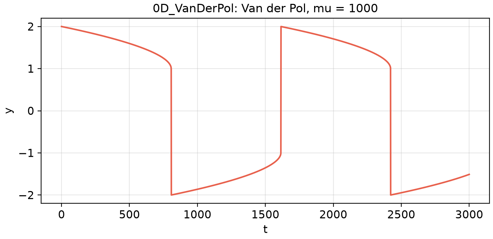

<!-- figures:0D_VanDerPol:begin -->
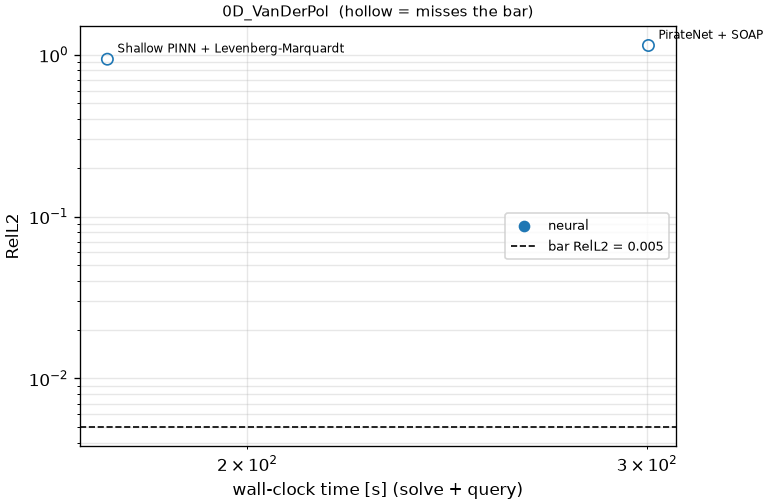 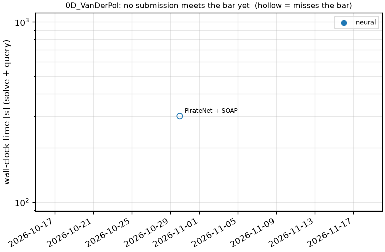
<!-- figures:0D_VanDerPol:end -->

### 1D_Steady_AdvectionDiffusion
Steady advection-diffusion `−ε u″ − u′ = 1` on [0, 1], ε = 0.01, `u(0) = u(1) = 0` ([Chebfun "Boundary layer for
advection-diffusion equation"](https://www.chebfun.org/examples/ode-linear/BoundaryLayer.html), Trefethen 2010).
The flow runs toward x = 0, where u drops from its outer solution 1 − x to 0 across a boundary layer of width ~ε
(u = ½ at x = ε ln 2, slope u′(0) ≈ 1/ε = 100). Output: 1001 uniform points (≈ 46 inside the layer). Reference:
exact solution.

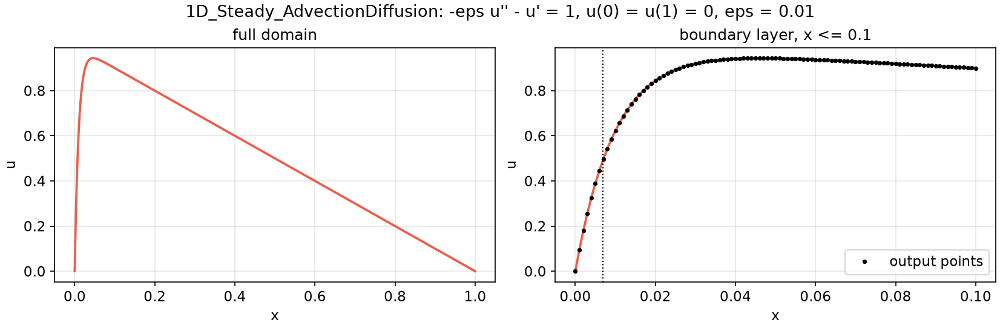

<!-- figures:1D_Steady_AdvectionDiffusion:begin -->
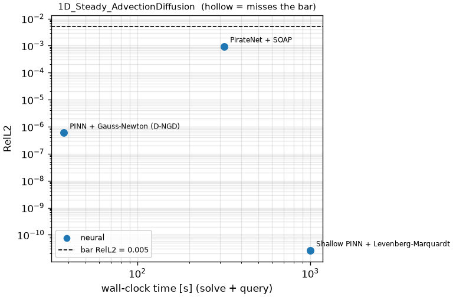 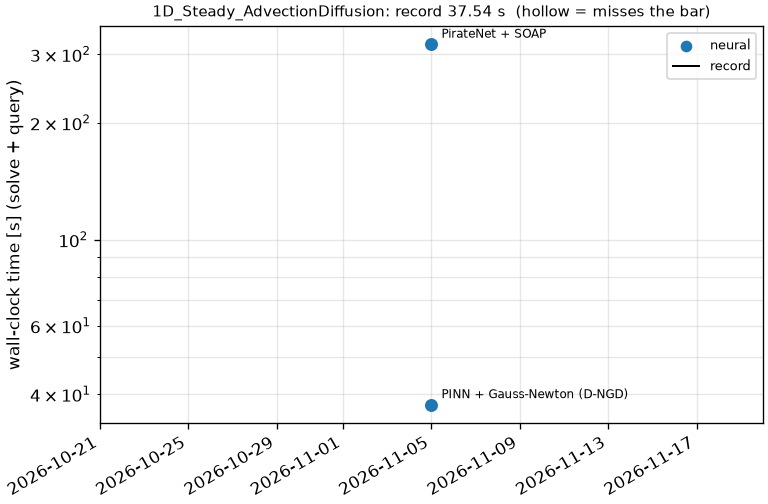
<!-- figures:1D_Steady_AdvectionDiffusion:end -->

### 1D_DampedWave
`u_tt = u_xx − 0.5 u_t` on (t, x) ∈ [0, 4] × [0, 1], `u = 0` at x = 0, 1, a narrow Gaussian pulse
`u(0, x) = exp(−(x − 0.3)²/(2·0.02²))`, `u_t(0, x) = 0`. The two halves cross the domain four times, reflecting
off the walls. Output: 801 t × 1001 x. Reference: exact sine series (closed-form coefficients).

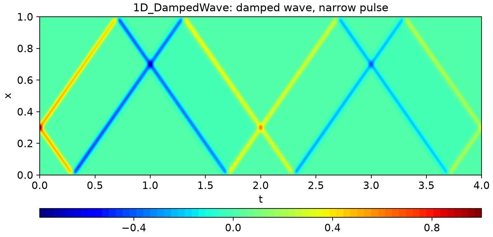

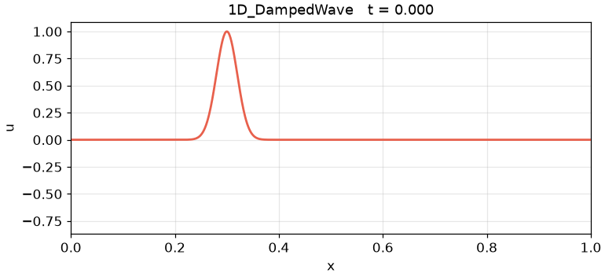

<!-- figures:1D_DampedWave:begin -->
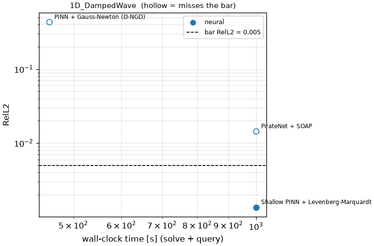 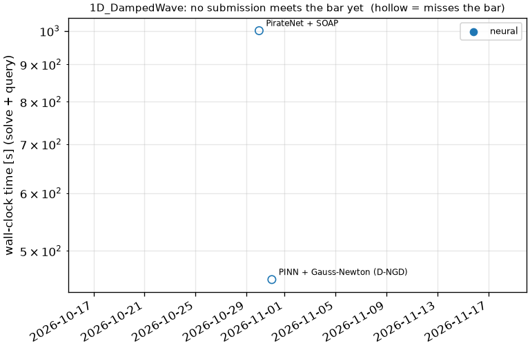
<!-- figures:1D_DampedWave:end -->

### 1D_Burgers
`u_t + u u_x = (0.01/π) u_xx` on (t, x) ∈ [0, 1] × [−1, 1], `u(0, x) = −sin(πx)`, `u = 0` at x = ±1 (Raissi et al.
2019; [Shahab et al. 2026](https://arxiv.org/abs/2602.08515), sec. 3.1); a stationary shock forms at x = 0 from
t ≈ 1/π. Output: 1001 t × 1001 x. Reference: exact Cole–Hopf solution by quadrature.

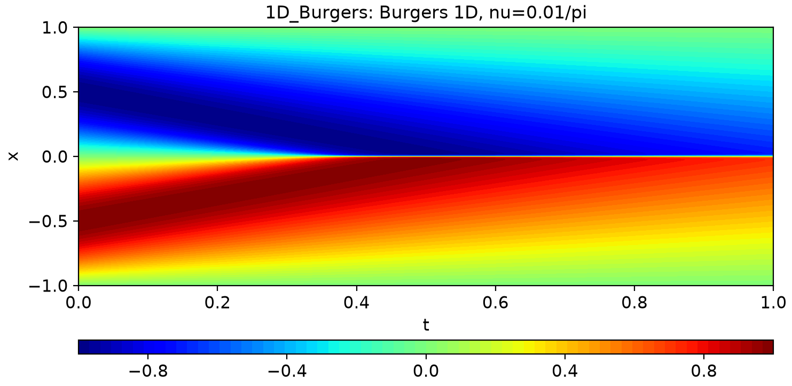

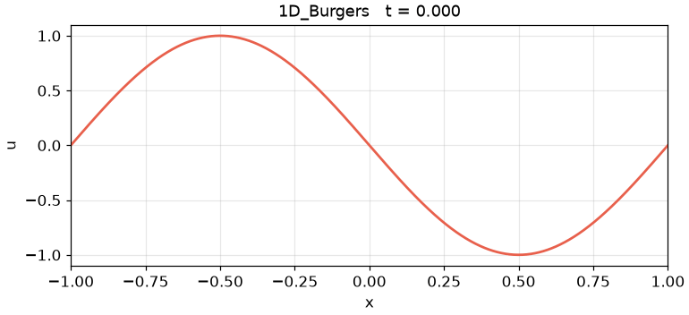

<!-- figures:1D_Burgers:begin -->
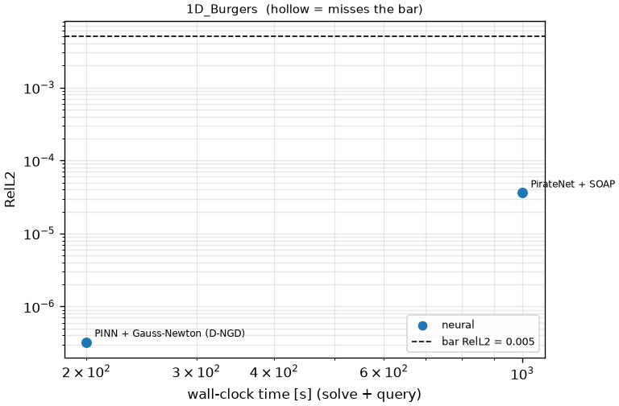 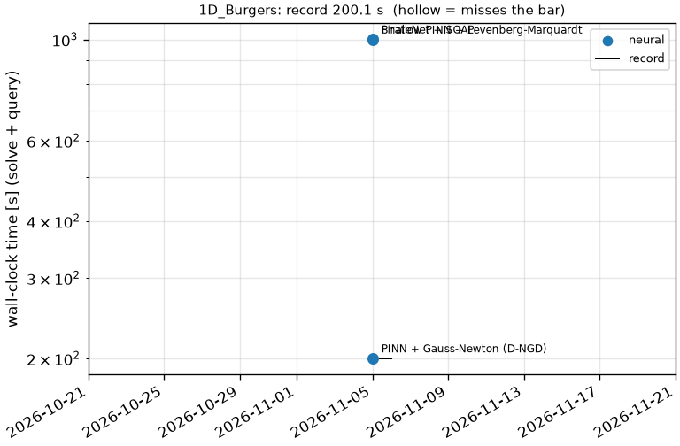
<!-- figures:1D_Burgers:end -->

### 1D_KuramotoSivashinsky
`u_t + (100/16) u u_x + (100/16²) u_xx + (100/16⁴) u_xxxx = 0`, x ∈ [0, 2π] periodic, t ∈ [0, 1], chaotic regime;
the initial state is given as samples. Output: 250 t × 512 x. Reference: published data.

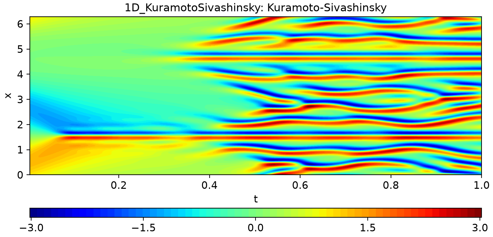

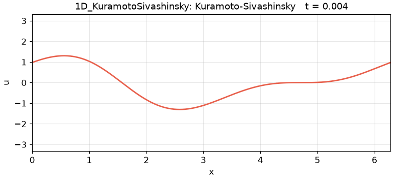

<!-- figures:1D_KuramotoSivashinsky:begin -->
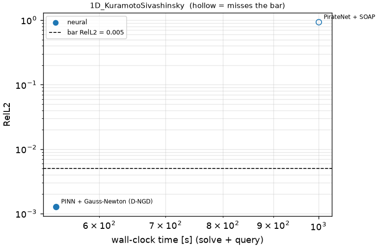 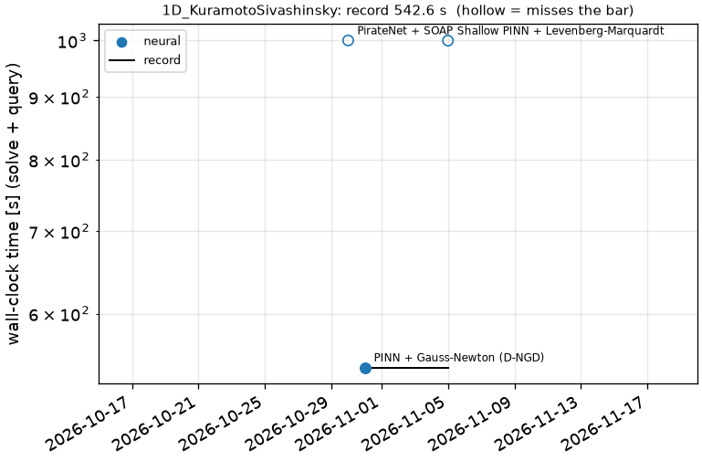
<!-- figures:1D_KuramotoSivashinsky:end -->

### 1D_AllenCahn
`u_t − 1e-4 u_xx + 5u³ − 5u = 0`, x ∈ [−1, 1] periodic, t ∈ [0, 1], `u(0, x) = x² cos(πx)`. Output: 200 t × 512 x.
Reference: published data.

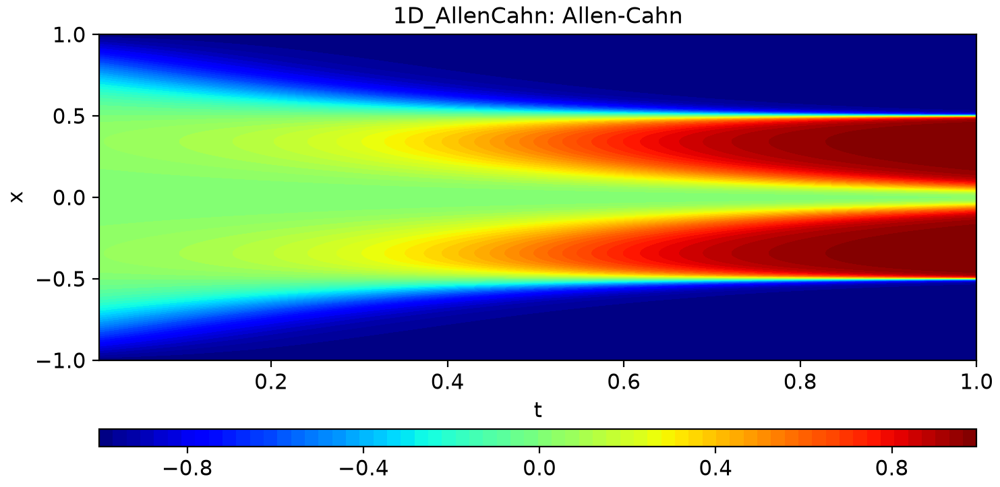

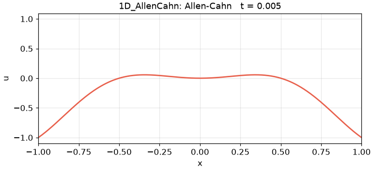

<!-- figures:1D_AllenCahn:begin -->
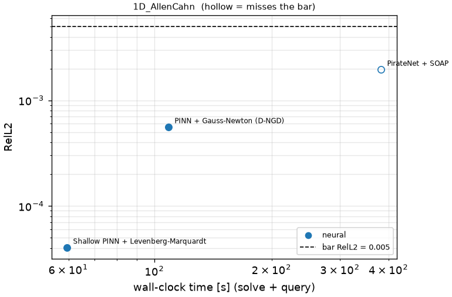 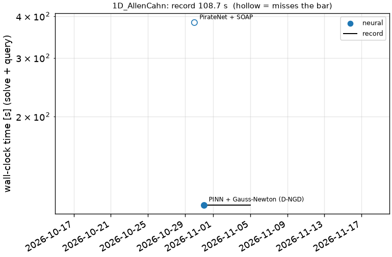
<!-- figures:1D_AllenCahn:end -->

### 1D_KdV
`u_t + u u_x + 0.022² u_xxx = 0`, x ∈ [−1, 1] periodic, t ∈ [0, 1], `u(0, x) = cos(πx)`; the cosine breaks into
solitons. Output: 200 t × 512 x. Reference: published data.

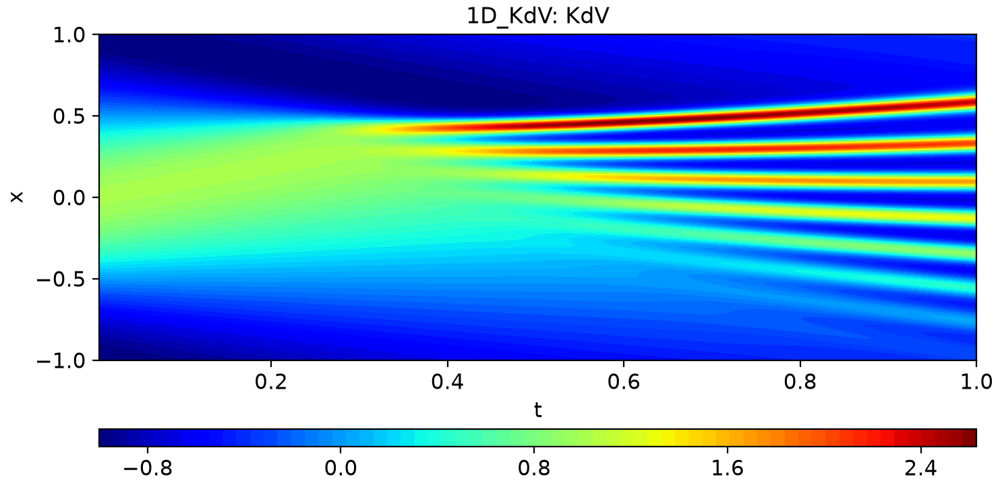

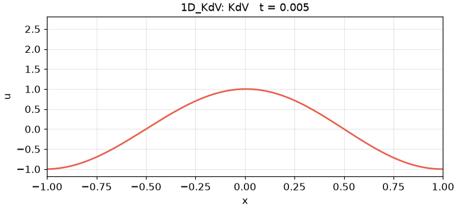

<!-- figures:1D_KdV:begin -->
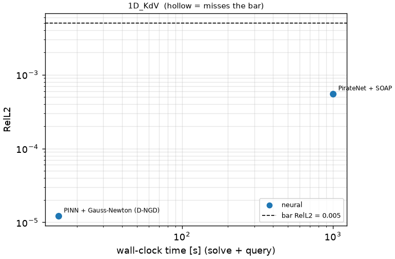 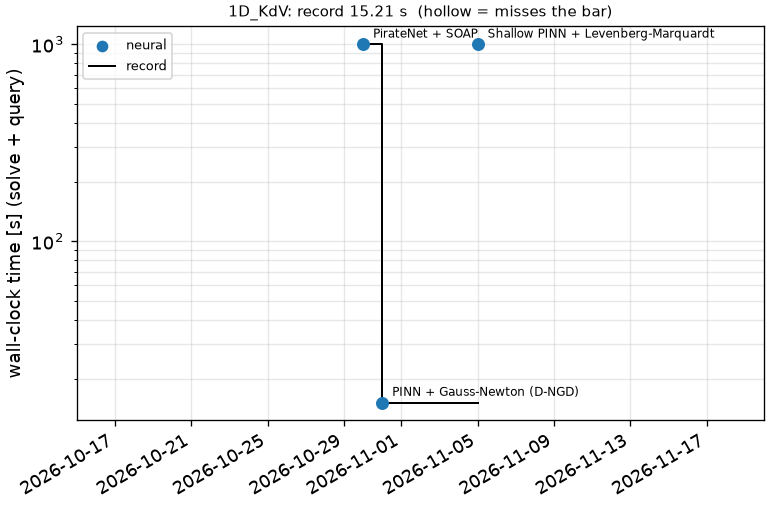
<!-- figures:1D_KdV:end -->

### 2D_Steady_Helmholtz: TODO
Scattering of a plane wave by a square in a disk, the [MATLAB PDE Toolbox
example](https://www.mathworks.com/help/pde/ug/helmholtzs-equation-on-disk-with-a-square-hole.html):
`−Δr − k²r = 0`, k = 60, `r = −exp(−ikx)` on the square, `∂r/∂n − ikr = 0` on the circle. The problem and its
mesh (9528 nodes, linear triangles) are defined; the reference is not yet. Linear FEM on that mesh is 16% from
the converged solution, so the reference will come from refinements of it, solved with a multigrid-preconditioned
iterative solver. Status and next steps: [TODO.md](tracks/2D_Steady_Helmholtz/TODO.md).

<!-- figures:2D_Steady_Helmholtz:begin -->
<!-- figures:2D_Steady_Helmholtz:end -->

### 2D_Steady_AdvectionDiffusion
Steady heat transport by a prescribed cellular flow, exactly the [Wolfram Demonstration of Binous, Bellagi &
Higgins (2015)](https://demonstrations.wolfram.com/SteadyStateTwoDimensionalConvectionDiffusionEquation/):
`(1/Pe) ΔT − u T_x − v T_y = 0` on [0, 1] × [0, 2], `u = −sin πx cos πy`, `v = cos πx sin πy`, Pe = 64,
cold wall `T(0, y) = 0`, hot wall `T(1, y) = 1`, insulated walls at y = 0, 2. Hot fluid is
swept along the insulated walls toward the cold wall and cold fluid back along y = 1. The solution is smooth.
Output: uniform 257 × 513 grid. Reference: Chebyshev collocation, N = 64 on one cell, mirrored about y = 1
(N = 48 agrees to 6e-12).

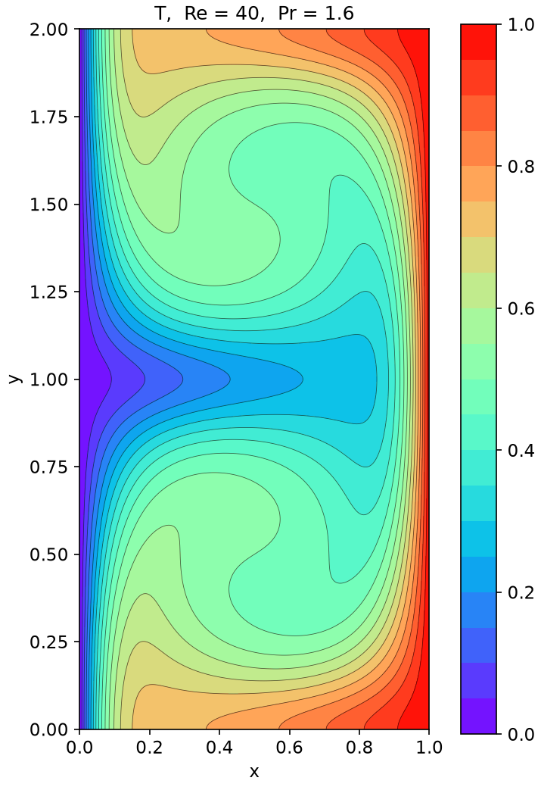 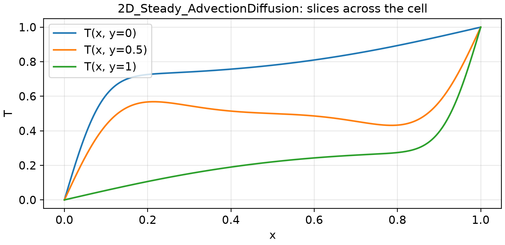

<!-- figures:2D_Steady_AdvectionDiffusion:begin -->
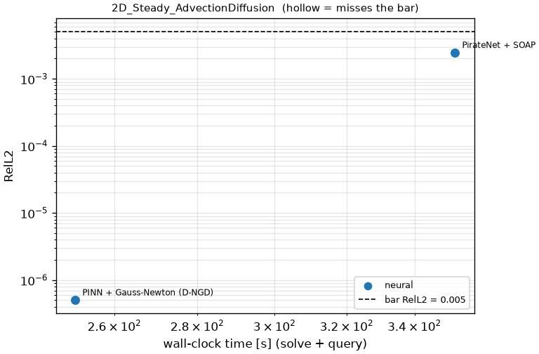 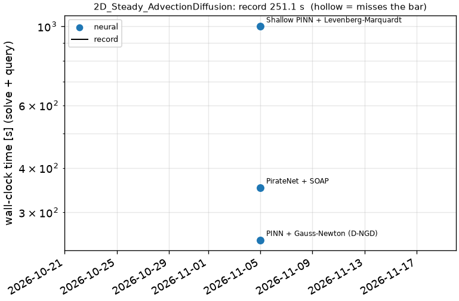
<!-- figures:2D_Steady_AdvectionDiffusion:end -->

### 2D_Steady_Kovasznay
Steady incompressible NS, Re = 40, on [−0.5, 2] × [−0.5, 1.5], with the Kovasznay velocity as Dirichlet data on the
whole boundary. Output: (u, v) on 251 × 201. Reference: closed form.

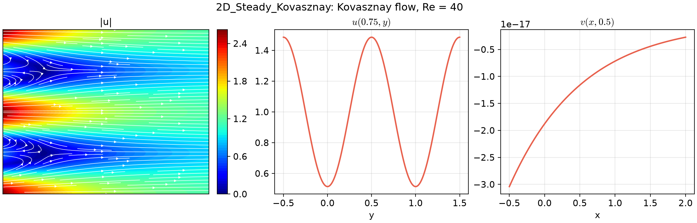

<!-- figures:2D_Steady_Kovasznay:begin -->
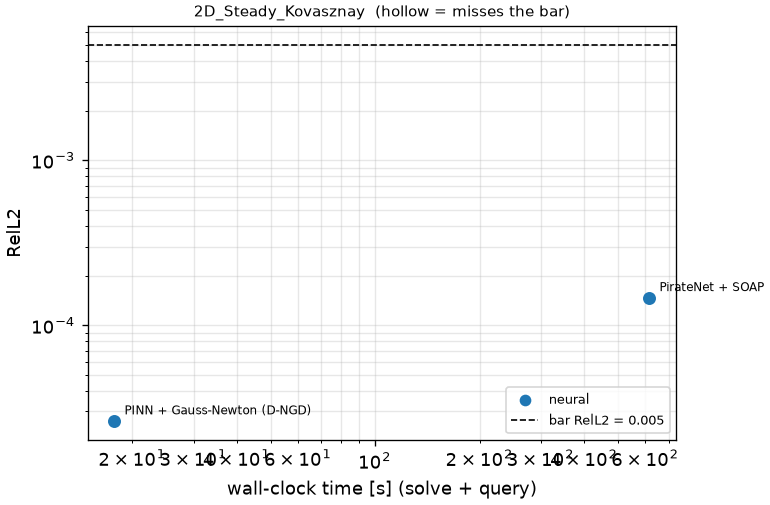 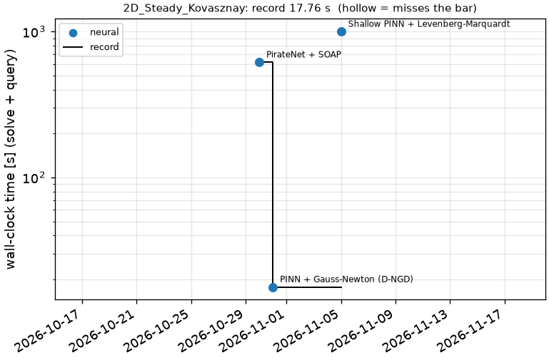
<!-- figures:2D_Steady_Kovasznay:end -->

### 2D_Steady_LidDrivenCavity
Steady NS, Re = 5000, in [0, 1]², lid `u = 1 − cosh(50(x − 0.5))/cosh(25)` on y = 1, no-slip elsewhere. Output: (u, v)
on 256². RelL∞ is scored at points ≥ 0.05 from the walls. Reference: published data.

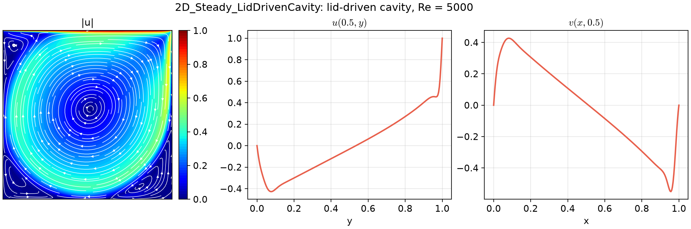

<!-- figures:2D_Steady_LidDrivenCavity:begin -->
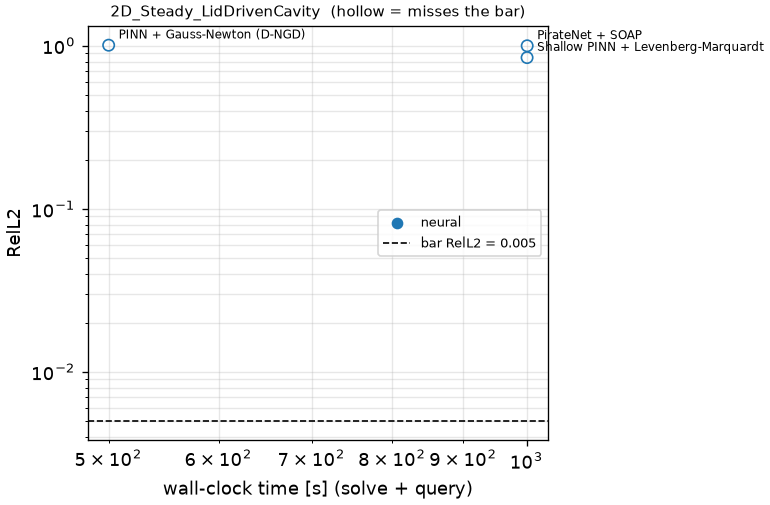 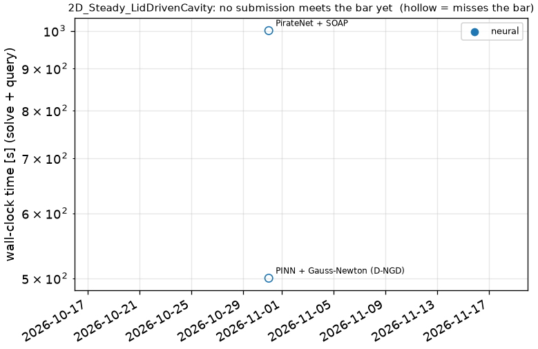
<!-- figures:2D_Steady_LidDrivenCavity:end -->

### 2D_CylinderFlow: TODO
Flow past a cylinder; see `tracks/2D_CylinderFlow/TODO.md`.

<!-- figures:2D_CylinderFlow:begin -->
<!-- figures:2D_CylinderFlow:end -->

### 2D_GreyScott
`u_t = 0.2 Δu + 40(1 − u) − 1000 u v²`, `v_t = 0.1 Δv − 100 v + 1000 u v²` on [−1, 1]² periodic, t ∈ [0, 2], initial
state given as samples. Output: (u, v) at 100 t × 200². Reference: published data.

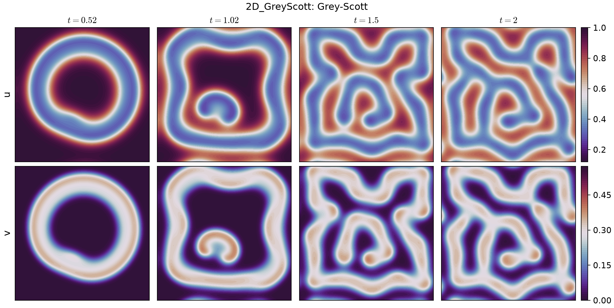

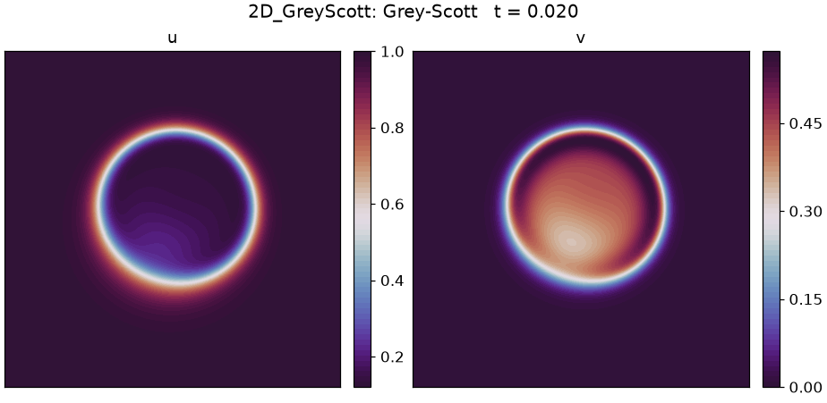

<!-- figures:2D_GreyScott:begin -->
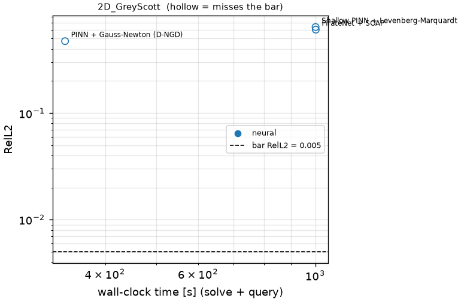 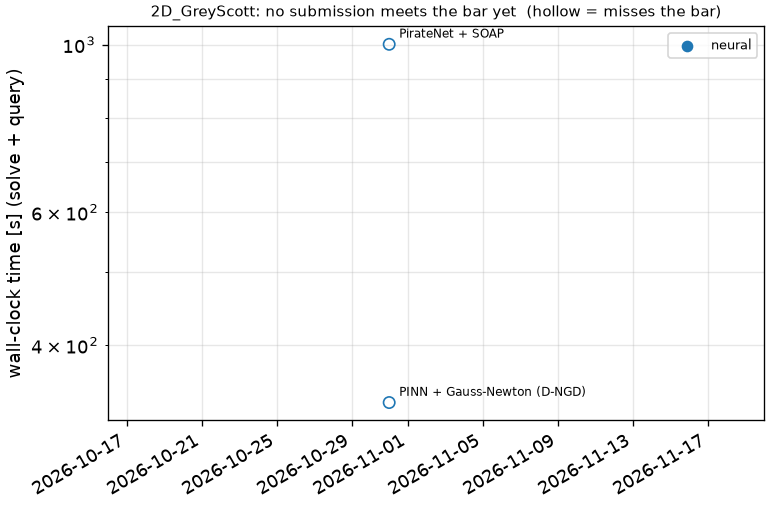
<!-- figures:2D_GreyScott:end -->

### 2D_GinzburgLandau
Complex Ginzburg–Landau for A = u + iv, ε = 0.004, k = 10, on [−1, 1]² periodic, t ∈ [0, 1], initial state given as
samples. Output: (u, v) at 100 t × 200². Reference: published data.

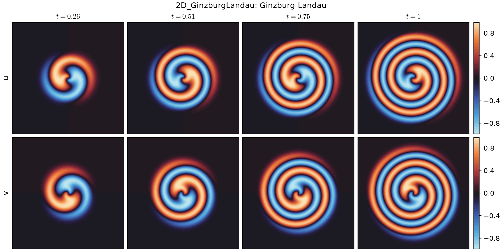

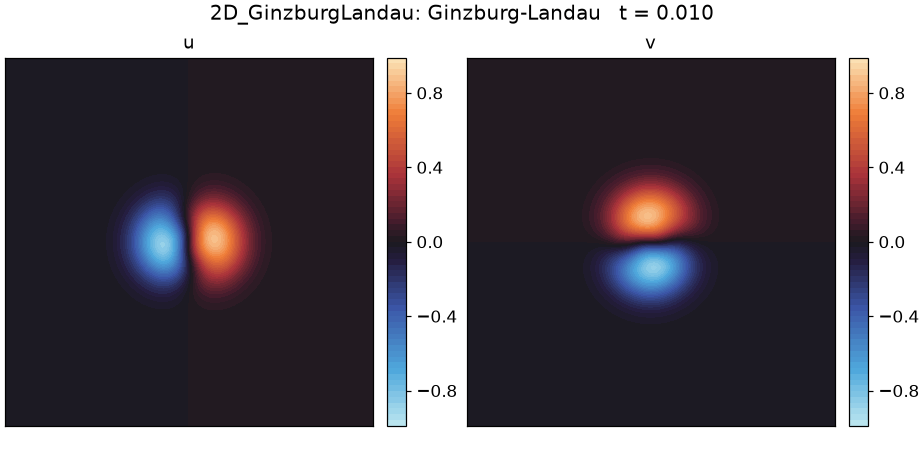

<!-- figures:2D_GinzburgLandau:begin -->
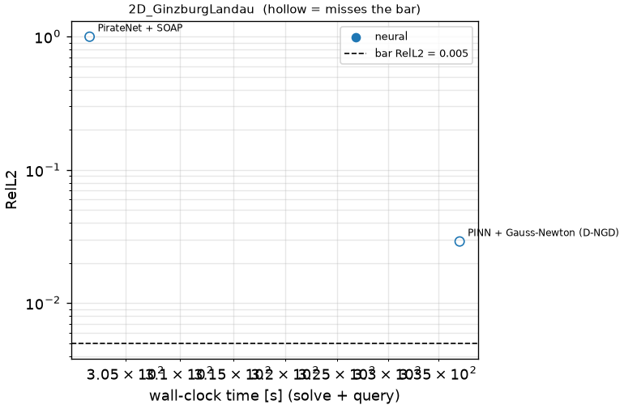 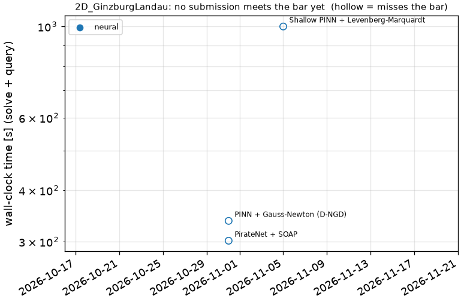
<!-- figures:2D_GinzburgLandau:end -->

### 2D_RayleighTaylor
Boussinesq Rayleigh–Taylor instability, Ra = 1e6, Pr = 0.71, on [0, 1] × [0, 2], t ∈ [0, 8.5], initial state given as
samples. Output: (u, v, T) at 34 t on a 100 × 200 grid. Reference: published data.

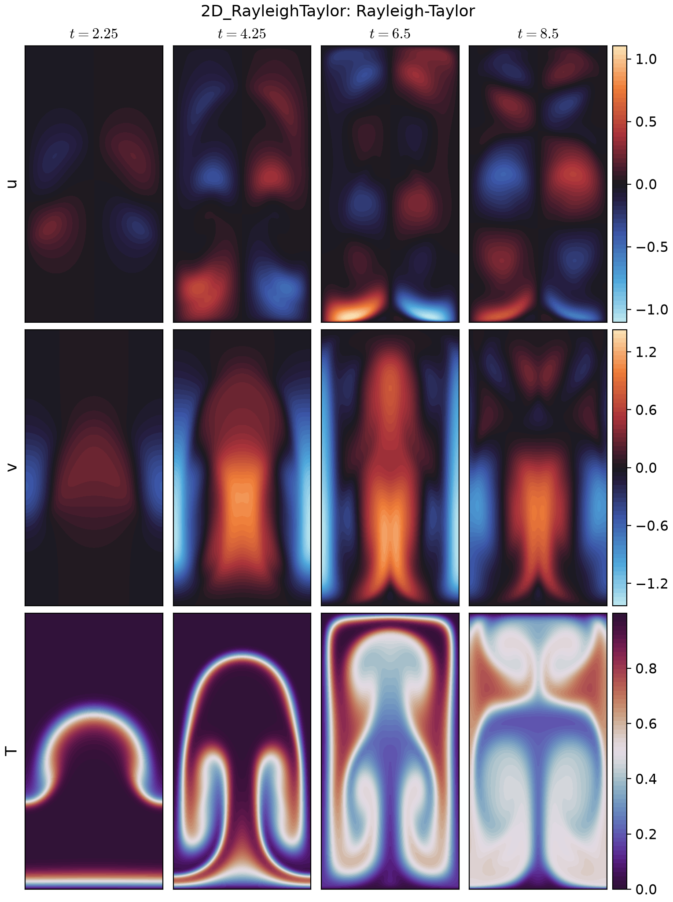

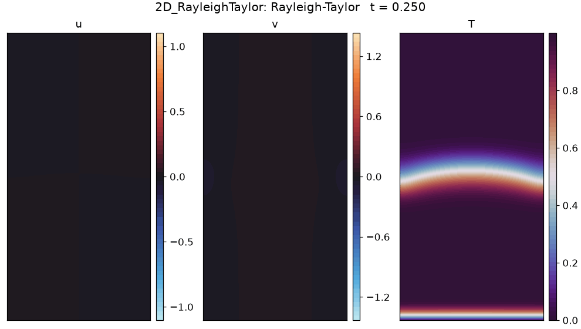

<!-- figures:2D_RayleighTaylor:begin -->
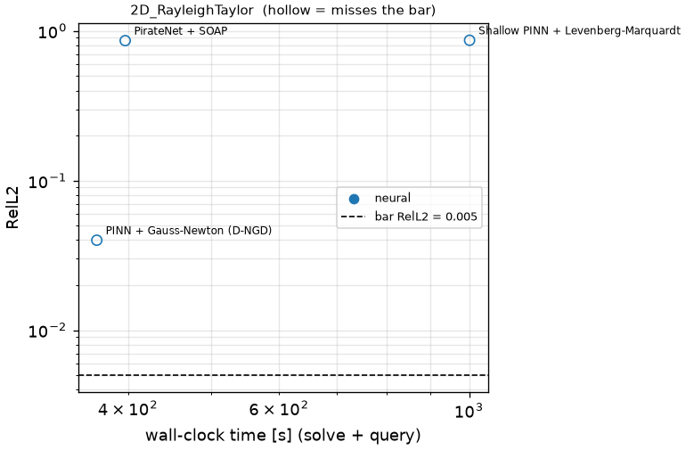 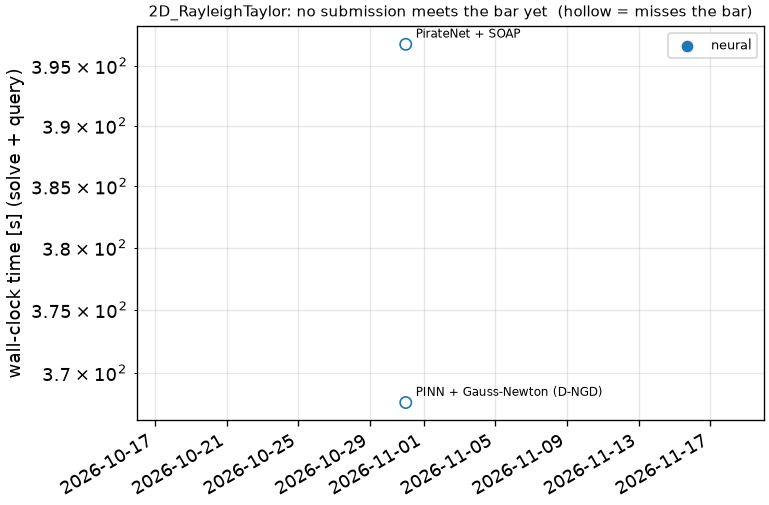
<!-- figures:2D_RayleighTaylor:end -->

### 2D_KolmogorovFlow
Forced 2D NS, Re = 1e4, forcing `2 sin(4πy)` in x, on [0, 1)² periodic, t ∈ [0, 1.96], initial state given as
samples; turbulent. Output: (u, v) at 49 t × 256². Reference: published data.

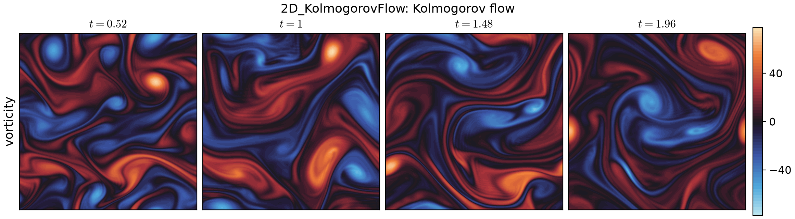

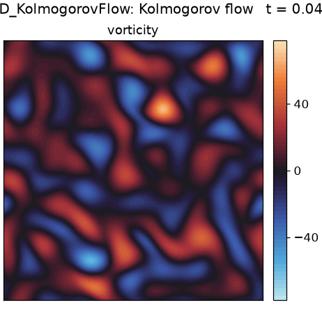

<!-- figures:2D_KolmogorovFlow:begin -->
 
<!-- figures:2D_KolmogorovFlow:end -->

## Layout

```
speedrun/
  problem.py  metrics.py  run.py (harness)  run_submission.py  devicecheck.py  make_reference.py  records.py
  tracks.py (registry, reference download)  external.py (published benchmark data)  plotting.py
  numerics/       classical toolbox: Chebyshev, Fourier/ETDRK4, Krylov, FV + multigrid, PN–PN-2 spectral elements
  submissions/    code shared across tracks by a submission: submission_PR<NNNN>/
tracks/<track>/
  problem.py  reference.py  baseline.py (record #0)  records.json  README.md
  figures/  reference/ (meta.json; ref.npz downloaded from the release)  data/ (initial states given as data)
  submissions/submission_PR<NNNN>/
```
